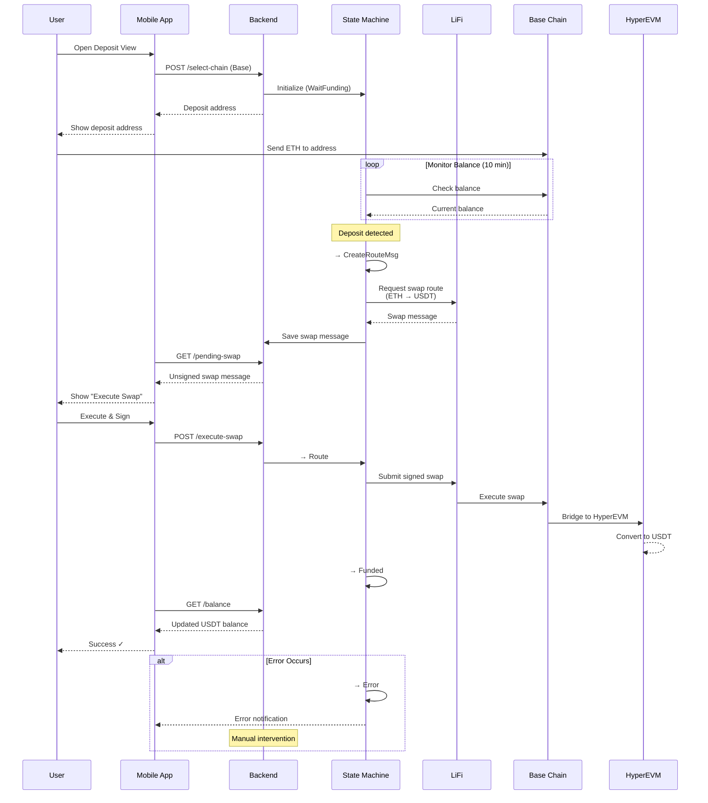

<br />
<p align="center">
  
</p>
<p align="center">
  <h3 align="center">Instant Expense Splitting - Powered By HyperLiquid</h3>
</p>

## Overview

HyperSplit lets groups split expenses with crypto-native settlement. It models each bill as a subgraph in a global debt graph, supports collaborative editing and confirmations, and executes on-chain payments. Users authenticate with Privy (SMS OTP → embedded wallet), can on-ramp from Base (ETH) to Hyperliquid (USDT) via LiFi, and settle debts on Hyperliquid. Hyperliquid Names are used for human‑readable identities; users can purchase a name and assign it to their Privy account. All chain RPC calls are performed via Alchemy.

Key capabilities:

- Bill creation, editing, membership, and readiness flows
- Debt graph per event with merge into a main graph and automatic sync with bills
- Payment preparation and execution on Hyperliquid EVM
- On/off ramp: Base → Hyperliquid via LiFi
- JWT-based auth with Privy identity tokens
- Hyperliquid Names: search, purchase, and assign to a Privy account
- RPC connectivity powered by Alchemy

## Architecture

The app helps groups split expenses by using bills. Each bill can have several items, and users can decide who pays for what. Tax and tip are shared across the items.

To track who owes whom, the app uses a debt graph. For every event (like a dinner or trip), it creates a separate subgraph. These subgraphs can later be merged into the main debt graph. For example, a dinner with A and B gets its own subgraph, and a trip with B, C, and D gets another.

Subgraphs can be in one of three states:

- Editing: Users can make changes.
- Confirmed: Ready to merge into the main graph, but still editable.
- Settled: All debts are paid, and no more changes are allowed.

A subgraph is merged into the main graph only after it’s confirmed. When someone makes a payment, both the main graph and the subgraph are updated. Once all debts in a subgraph are paid, it becomes settled and locked.

This system lets users manage debts for each event separately, while keeping the overall debt graph accurate.

The bill and debt graph always stay in sync:

- Creating a bill makes a new subgraph.
- Saving a bill confirms the subgraph.
- Settling a subgraph marks the bill as paid.
- Editing a bill puts the subgraph back into editing mode.

Once any payment is made, the bill can’t be edited anymore. This avoids problems with keeping the bill and debt graph consistent after payments. For example, if Jon and Roman have a bill and Jon pays part of his share, it would be too complicated to allow further edits.

If no payments have been made, editing the bill is easy—the debt graph just updates to match.

Each bill has a creator and a list of members. Members can invite others to join. The creator can also remove members.

Bills contain items, each with a name, description, price, and quantity. While a bill is in editing, any member can add items. Items can be assigned to one or more members, and the cost is split equally (for example, 3 owners each pay 33.33%).

When a bill is created, all items are split equally between the members defined in the bill creation request.

There is an endpoint to mark a user as “ready” for a bill. A bill can only be saved if all users are marked as ready. Each user can only mark themselves as ready, except for the creator, who can mark others as ready.

## On-Off Ramp



The app currently allows users to on-ramp from ETH on the Base network to USDT on Hyperliquid, using LiFi as the routing provider.

In the future, we plan to expand support so users can on-ramp from any blockchain and any token to USDT on Hyperliquid.

The flow works as follows: after a user selects a chain, the mobile app sends a POST request to the backend (select-chain endpoint) with the selected chain ID and user information. This triggers a backend state machine to manage the deposit process for that user.

The state machine operates through these stages:

- WaitFunding: The backend monitors the user’s balance on the selected chain for up to 10 minutes, waiting for a deposit.
- CreateRouteMsg: When a deposit is detected, the state advances to CreateRouteMsg. At this point, a LiFi swap message is generated to move the full deposited amount to HyperEVM USDT. This message is saved in the database for the user.
- Route: After the mobile app receives the swap message, it signs it and sends a POST request to the backend to initiate the swap. The backend enters the Route state and begins polling for the swap’s status.
- Funded: Once the swap is complete and the funds are received, the state advances to Funded. The mobile app then updates the user’s balance.
- Error: If any step fails, the state moves to Error, which may require manual intervention.

At launch, only ETH on-ramp is supported, so gas fees are automatically deducted from the swap. For future ERC-20 support, we may need to pre-fund gas by deploying a contract on HyperEVM to receive the ERC-20, deduct gas fees, and then send USDT to the user. This enhancement is planned for later.

## Authentication

We use Privy to manage the user resource. Users log in via SMS OTP and are then added as a user resource in Privy. Then, we generate an embedded Ethereum wallet that the user will use to transact.

The backend has its own representation of users that are linked via external ID pointing to the
authenticated Privy user.

To authenticate and authorize requests to the BE, the frontend will include a Privy JWT identity token in the request. The BE will then use those
tokens against a privy REST API for getting the user's information, such as phone number and external ID. (Docs: https://docs.privy.io/user-management/users/identity-tokens)

## Getting Started

### Prerequisites

- Go 1.23+
- Docker and Docker Compose (for local Postgres)
- make (optional, recommended)

### 1) Start Postgres locally (Docker)

Run Postgres using the provided compose file:

```bash
docker compose -f docker-compose.yml up -d postgres
# or, using Makefile helper
make dc-upd-postgres
```

Default credentials (from docker-compose):

- DB: hsplit_test
- User: admin
- Password: password
- Port: 5432

### 2) Configure environment

Create a .env file in the repository root. Minimum local config:

```bash
PORT=8080

# Database (match docker-compose values)
HSPLIT_DATABASE_HOST=localhost
HSPLIT_DATABASE_PORT=5432
HSPLIT_DATABASE_DATABASE=hsplit_test
HSPLIT_DATABASE_USERNAME=admin
HSPLIT_DATABASE_PASSWORD=password
HSPLIT_DATABASE_SSL_MODE=disable
HSPLIT_DATABASE_USE_POOLER=false

# Auth
HSPLIT_AUTH_PRIVY_APP_ID=your-privy-app-id

# Providers (optional but recommended for full functionality)
HSPLIT_PROVIDERS_LIFI_API_KEY=your-lifi-api-key
HSPLIT_PROVIDERS_ALCHEMY_API_KEY=your-alchemy-api-key
HSPLIT_PROVIDERS_HLNAMES_API_KEY=your-hlnames-api-key
# Usually fine to leave default, but overridable if needed
HSPLIT_PROVIDERS_HLNAMES_BASE_URL=https://api.hlnames.xyz
```

Notes:

- All configuration can be set via environment variables with the `HSPLIT_` prefix.
- See `internal/config/config.go` for full structure and defaults.
- EVM RPCs default to Alchemy endpoints; provide `HSPLIT_PROVIDERS_ALCHEMY_API_KEY` to use your key.

### 3) Install deps and run migrations

```bash
make deps
make db-migrate
```

If you prefer model-based table creation for a fresh DB instead of SQL migrations, you can run:

```bash
make db-create
```

### 4) Run the API

```bash
make run
# or
go run ./cmd/hsplit-service
```

The service listens on `:${PORT}` (default 8080).

### 5) Health check

```bash
curl -s http://localhost:${PORT:-8080}/health | jq
```

### 6) Run tests

```bash
make test
```

## iOS App (Quick Start)

Requirements:

- Xcode 15+
- iOS 17+ simulator or device

Steps:

1. Start the backend locally (see Getting Started above).
2. Update the mobile app backend URL:
   - Edit `mobile/HyperSplit/Utils/Constants.swift` → `Constants.API.baseURL`
   - Simulator: `http://127.0.0.1:8080`
   - Physical device: use your Mac's LAN IP, e.g. `http://192.168.x.y:8080`, and ensure both are on the same network
3. Ensure backend `HSPLIT_AUTH_PRIVY_APP_ID` matches `Constants.API.privyAppId` in the app.
4. Open `mobile/HyperSplit.xcodeproj` in Xcode, select the `HyperSplit` scheme, set your Signing Team if needed, and Run.

