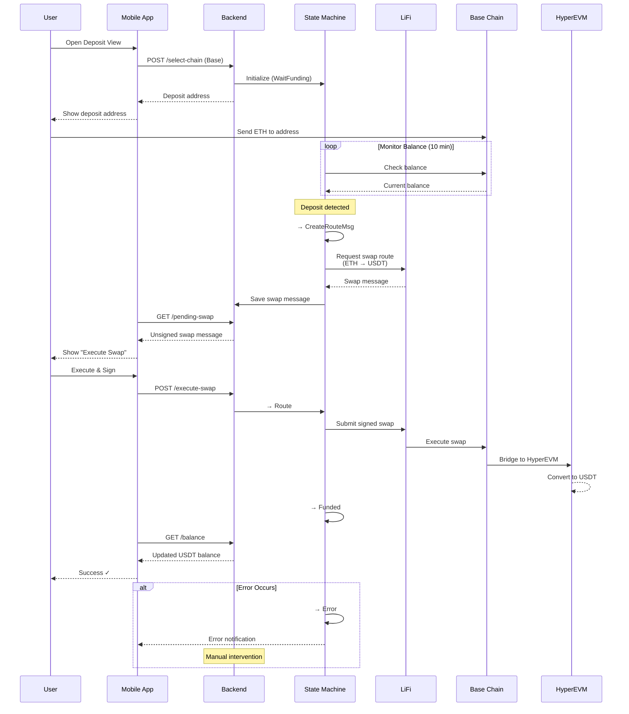

<br />
<p align="center">
  
</p>
<p align="center">
  <h3 align="center">Instant Expense Splitting - Powered By HyperLiquid</h3>
</p>

## Overview

HyperSplit is a bill splitting mobile app built on crypto rails that enables instant settlement. No more chasing friends for money or waiting for bank transfers - split & settle immediately.

HyperSplit lets friends split expenses with crypto-native settlement. It models each bill as a subgraph in a global debt graph, supports collaborative editing and confirmations, and executes on-chain payments. Users authenticate with Privy (SMS OTP → embedded wallet), can on-ramp from Base (ETH) to Hyperliquid (USDT) via LiFi, and settle debts on Hyperliquid. Hyperliquid Names are used for human‑readable identities; users can purchase a name and assign it to their Privy account. All chain RPC calls are performed via Alchemy.

Key capabilities:

- Bill creation, editing, membership, and readiness flows
- Debt graph per event with merge into a main graph and automatic sync with bills
- Payment preparation and execution on Hyperliquid EVM
- On/off ramp: Base → Hyperliquid via LiFi
- JWT-based auth with Privy identity tokens
- Hyperliquid Names: search, purchase, and assign to a Privy account
- RPC connectivity powered by Alchemy

## Technical Stack

The backend is built with Go using the Gin framework for HTTP routing and middleware. Data persistence uses PostgreSQL hosted on Supabase with the Bun ORM for type-safe database operations. The architecture follows a clean layered approach with separated API, business logic, and data access layers, using a singleton store pattern for centralized database access.

For blockchain settlement, the system integrates with Hyper EVM where users execute final settlements. The on/off ramp system enables users to bridge assets from supported blockchains (currently Base/ETH) to USDT on Hyperliquid using LiFi as the routing provider. The backend monitors wallet balances, generates swap transactions, and manages the entire deposit flow through a state machine architecture.

## Architecture

The app helps groups split expenses by using bills. Each bill can have several items, and users decide who pays for what. Tax and tip are shared across the items.

To track who owes whom, the app uses a debt graph. For every event (like a dinner or trip), it creates a separate subgraph. These subgraphs can later be merged into the main debt graph. For example, a dinner with A and B gets its own subgraph, and a trip with B, C, and D gets another.

Subgraphs can be in one of three states:

- Editing: Users can make changes.
- Confirmed: Ready to merge into the main graph, but still editable.
- Settled: All debts are paid, and no more changes are allowed.

A subgraph is merged into the main graph only after it’s confirmed. When someone makes a payment, both the main graph and the subgraph are updated. Once all debts in a subgraph are paid, it becomes settled and locked.

This system lets users manage debts for each event separately, while keeping the overall debt graph accurate.

The bill and debt graph always stay in sync:

- Creating a bill makes a new subgraph.
- Saving a bill confirms the subgraph.
- Settling a subgraph marks the bill as paid.
- Editing a bill puts the subgraph back into editing mode.

Once any payment is made, the bill can’t be edited anymore. This avoids problems with keeping the bill and debt graph consistent after payments. For example, if Jon and Roman have a bill and Jon pays part of his share, it would be too complicated to allow further edits.

When a bill is created, all items are split equally between the members defined in the bill creation request.

## On-Off Ramp



The app allows users to on-ramp from ETH on the Base network to USDT on Hyperliquid, using LiFi as the routing provider.

In the future, we plan to expand support so users can on-ramp from any blockchain and any token to USDT on Hyperliquid.

The flow works as follows: after a user selects a chain, the mobile app sends a POST request to the backend (select-chain endpoint) with the selected chain ID and user information. This triggers a backend state machine to manage the deposit process for that user.

The state machine operates through these stages:

- `WaitFunding`: The backend monitors the user’s balance on the selected chain for up to 10 minutes, waiting for a deposit.
- `CreateRouteMsg`: When a deposit is detected, the state advances to CreateRouteMsg. At this point, a LiFi swap message is generated to move the full deposited amount to HyperEVM USDT. This message is saved in the database for the user.
- `Route`: After the mobile app receives the swap message, it signs it and sends a POST request to the backend to initiate the swap. The backend enters the Route state and begins polling for the swap’s status.
- `Funded`: Once the swap is complete and the funds are received, the state advances to Funded. The mobile app then updates the user’s balance.
- `Error`: If any step fails, the state moves to Error, which may require manual intervention.

At launch, only ETH on-ramp is supported, so gas fees are automatically deducted from the swap. For future ERC-20 support, we may need to pre-fund gas by deploying a contract on HyperEVM to receive the ERC-20, deduct gas fees, and then send USDT to the user. This enhancement is planned for later.


## Hyperliquid Hackathon Categories

- **Hyperliquid Frontier Track**
  - HyperSplit mobile app is solving a real problem - instant expense splitting and permissionless onboarding - no KYC, no bank account required.
- **Best use of Privy**
  - We use Privy to manage the user resource. Users log in via SMS OTP and are then added as a user resource in Privy. Then, we generate an embedded Ethereum wallet that the user will use to transact. With Privy, we are able to completely abstract signatures away from the user, offerring a seamless experience focused on the key value of instant expense splitting.
- **Best use of LiFi**
  - LiFi is our on/off ramp solution from anywhere on crypto. We have built a custom service and a state-machine, that watches user addresses on selected chains. Once a balance update is detected, the funds are swapped to USDT on Hyperliquid to enable them to participate in the app. The routing is completely abstracted from the user, and they are not aware of the underlying mechanics.
- **Best use of Alchemy**
  - We use Alchemy to get the balance of the user's wallet as well as RPC capabilities across EVMs. Alchemy is a great choice for this use case because it provides a reliable and scalable way to interact with Ethereum-based blockchains.
- **Best showcase of identity with Hyperliquid names .hl**
  - For finding their friends, users can use their .hl name instead of their wallet address. Users can search for their friends by name, and the app will show them in the list of friends. There is a UX to purchase a name and assign it to their Privy account.

## Getting Started

The access is only shared with the Hyperliquid hackathon organizers.
If you are a judge, please find instructions on how to set up[here](https://github.com/czarcas7ic/hsplit-chain-be).

If you are not a judge but would like to see the code or get access to the app, please contact `@p0mvn`:
- [X](https://x.com/akhtariev)
- Telegram: `@rakhtariev`

## Live Deployment

If you'd like to test the live backend while building the mobile app, you can integrate against the live backend:

```bash
curl https://hsplit-be-production.up.railway.app/health
{"database":true,"service":"hsplit-service","status":"healthy","timestamp":"2025-08-25T01:07:13.235774719Z","version":"1.0.0"}%
```